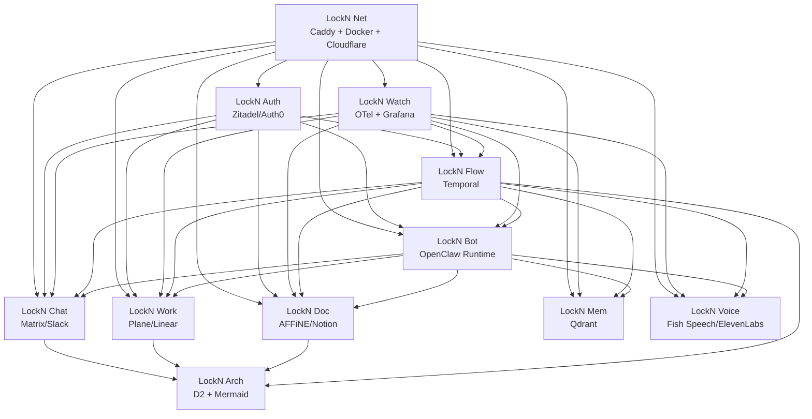

# LockN AI — Implementation Roadmap & Product Handoff

**Prepared for:** Product + Engineering alignment  
**Date:** 2026-02-11  
**Scope:** Productizable, provider-agnostic agentic operating system built on **.NET Aspire**

---

## 0) Executive Summary (Product-Team Read)

LockN AI can be de-risked and productized fastest by separating **platform control plane** from **provider implementations**. The core strategy is:

1. Build a strong **abstraction layer** first (interfaces + contracts + Aspire wiring).
2. Wrap today’s stack (Auth0, Slack, Linear, Notion, ElevenLabs, etc.) behind those interfaces so behavior remains unchanged.
3. Migrate one module at a time to owned/OSS alternatives (Zitadel, Matrix, Plane, AFFiNE, Fish Speech), using bridge/sync patterns to avoid downtime.
4. Keep observability, identity, and orchestration as first-class dependencies from day one.

### Recommended first owned module
**LockN Work (Plane)** is the best first OSS migration target after foundation/adapters:
- High customer-visible value
- Lower migration risk than Auth or Chat
- Clear sync/bridge strategy from Linear
- Strong demonstration of “owned stack” progress

### Critical path
**Net + Auth + Watch + Flow + Bot abstractions** are the critical path. If these slip, all downstream module migrations slip.

### High-level timeline (confidence weighted)
- **Phase 0 (Foundation):** 2–3 weeks (High confidence)
- **Phase 1 (Adapterization of current stack):** 4–6 weeks (Med-High)
- **Phase 2 (First OSS module + production cutover):** 4–8 weeks (Medium)
- **Phase 3 (Full owned stack program):** 4–6 months total (Medium-Low on long tail)

### Product implications
- During transition, some customers may run hybrid mode (e.g., Slack + Matrix, Auth0 + Zitadel).
- Packaging should support **BYO provider** and **LockN-owned managed providers**.
- Near-term GTM narrative: “No rip-and-replace required; migrate safely at your pace.”

---

## 1) Module Dependency Graph

## 1.1 Dependency principles

- **LockN Net** underpins all deployable services (routing, TLS, edge, containers).
- **LockN Auth** is a hard dependency for user/workspace identity and policy.
- **LockN Watch** should be embedded in every module from day one (telemetry contract).
- **LockN Flow** orchestrates long-running workflows and cross-module tasks.
- **LockN Bot** is the runtime brain that binds modules into an agentic UX.
- **LockN Chat/Work/Doc/Mem/Voice** are capability modules consumed by Bot + Flow.
- **LockN Arch** is documentation/communication support and depends on data from other modules.

## 1.2 Mermaid dependency diagram



## 1.3 Critical path

**Critical path sequence:**
1. LockN Net baseline (runtime + ingress + secrets + env strategy)
2. LockN.Abstractions + service contracts
3. LockN Watch defaults (traces/logs/metrics + dashboards)
4. LockN Auth abstraction + Auth0 adapter
5. LockN Flow skeleton (Temporal workers + durable workflow primitives)
6. LockN Bot integration against interfaces

Until this is complete, migration of Chat/Work/Doc/Voice is fragile.

---

## 2) Build Order & Phases

## 2.1 Phase 0 — Foundation (2–3 weeks)

### Goals
- Create stable platform shell where all modules are plug-replaceable.

### Deliverables
1. **Aspire AppHost scaffolding**
   - AppHost project + per-module service registration
   - Standard local compose/deploy profile for WSL2 + Docker
2. **LockN.Abstractions**
   - Provider interfaces + DTO contracts + capability flags
   - Cross-module event schema (correlation IDs, tenant/workspace IDs)
3. **Service defaults package**
   - OTel setup, structured logging, health checks, retries, circuit breakers
   - Standard auth middleware hooks + policy evaluation points
4. **Golden path CI/CD**
   - Build/test/lint + smoke integration suite for adapter contracts

### Exit criteria
- A single demo scenario runs through interfaces (even if mocked):
  user command → bot runtime → work/chat/doc call → telemetry visible.

---

## 2.2 Phase 1 — Adapt Current Stack (4–6 weeks)

### Goal
Keep existing behavior exactly the same, but all calls route through LockN provider interfaces.

### Recommended adapter order
1. **Auth0 adapter (`ILocknAuthProvider`)**
2. **Slack adapter (`ILocknChatProvider`)**
3. **Linear adapter (`ILocknWorkProvider`)**
4. **Notion adapter (`ILocknDocProvider`)**
5. **Qdrant adapter (`ILocknMemoryProvider`)**
6. **ElevenLabs adapter (`ILocknVoiceProvider`)**
7. **Cloudflare/Caddy adapter (`ILocknNetProvider`)**

This order supports immediate stabilization of existing user paths.

### Phase 1 effort table

| Module Adapter | Estimate | Complexity | Risk | Notes |
|---|---:|---|---|---|
| Auth0 | 4–6 days | M | M | Token lifecycle, tenant mapping |
| Slack | 5–8 days | M | M | Channel/thread semantics |
| Linear | 5–8 days | M | M | Status/state mapping |
| Notion | 6–10 days | M/H | M | Rich content edge cases |
| Qdrant | 3–5 days | S/M | L/M | Dimensionality/versioning checks |
| ElevenLabs | 2–4 days | S | L | Mainly API wrapper + QoS |
| Net (Cloudflare/Caddy glue) | 6–10 days | H | M/H | DNS/edge cert automation |

### Exit criteria
- Regression suite proves parity vs current behavior.
- Bot runtime uses only interfaces (no direct third-party SDK calls in business logic).

---

## 2.3 Phase 2 — First OSS Module (4–8 weeks)

## Decision analysis: first owned module

### Candidates
- **Auth (Zitadel)**: High strategic importance, high risk.
- **Chat (Matrix)**: High visibility, complex bridge UX/ops.
- **Work (Plane)**: High value, manageable migration complexity.
- **Doc (AFFiNE)**: Valuable but content migration complexity can spike.

### Recommendation
**First OSS module: LockN Work (Linear → Plane)**

**Why:**
- Fastest meaningful “owned-stack” proof without identity downtime risk.
- Work items are structured and sync-friendly.
- Product can market early self-host/sovereign capability.

### Suggested sequence after first module
1. Work (Plane)
2. Doc (AFFiNE)
3. Chat (Matrix)
4. Auth (Zitadel) — only after platform maturity and SSO test matrix hardening

---

## 2.4 Phase 3 — Full Stack Ownership (4–6 months program)

## Work streams

### Stream A (Platform/Core)
- Auth, Flow, Watch, Net hardening

### Stream B (Customer-Facing Apps)
- Chat, Work, Doc

### Stream C (Intelligence)
- Mem, Voice, Bot improvements

### Team sizing (suggested)
- **2 platform engineers** (.NET + infra)
- **2 integration engineers** (provider adapters, migrations)
- **1 product engineer** (bot/chat UX + flows)
- **0.5–1 SRE/DevOps** shared
- **0.5 QA automation** shared

### Timeline sketch
- Month 1–2: Foundation + adapter parity + first OSS (Work)
- Month 3: Doc migration + Chat bridge in production
- Month 4: Auth migration pilots + Voice OSS option
- Month 5–6: full default-owned stack, legacy providers optional

---

## 3) Per-Module Technical Spec

## 3.1 LockN Bot (OpenClaw Runtime)
- **Current:** Node.js runtime directly invoking provider APIs/tools.
- **Pain points:** Tight coupling, uneven policy/telemetry, hard provider swaps.
- **Target:** Bot orchestration strictly via interfaces/events.
- **Interface summary:**
  - `ExecuteTask(request)`
  - `DispatchToolCall(capability, payload)`
  - `PublishEvent(event)`
- **Migration:** Incremental strangler (route one capability at a time).
- **Effort:** L
- **Risk:** Medium
- **Dependencies:** Auth, Watch, Flow, all provider interfaces
- **Acceptance:** 95%+ bot flows run without direct SDK calls; traceable end-to-end.

## 3.2 LockN Chat (Slack → Matrix)
- **Current:** Slack-based communications.
- **Pain points:** Vendor dependency, pricing/control limits.
- **Target:** Matrix native + Slack bridge mode.
- **Interface summary:**
  - `SendMessage(channel, message)`
  - `ReadMessages(cursor)`
  - `React(messageId, emoji)`
  - `MapIdentity(externalUser)`
- **Migration:** Bridge (dual-write / selective dual-read), then cutover.
- **Effort:** L
- **Risk:** High (message semantics, thread parity)
- **Dependencies:** Auth identity map, Net, Watch
- **Acceptance:** Message delivery SLO met; bridge loss <0.1%; reversible cutover.

## 3.3 LockN Auth (Auth0 → Zitadel)
- **Current:** Auth0 tenant for authn/authz.
- **Pain points:** lock-in, cost growth, limited sovereignty.
- **Target:** Zitadel (self/managed) with same token contract.
- **Interface summary:**
  - `ValidateToken(token)`
  - `IssueServiceToken(scope)`
  - `SyncUserProfile(user)`
  - `GetWorkspaceClaims(userId)`
- **Migration:** Parallel IdP + token broker + phased audience migration.
- **Effort:** XL
- **Risk:** High
- **Dependencies:** Net, Watch, policy model, customer SSO requirements
- **Acceptance:** zero auth downtime; token validation compatibility; rollback verified.

## 3.4 LockN Work (Linear → Plane)
- **Current:** Linear work-item management.
- **Pain points:** vendor dependence, customization limits.
- **Target:** Plane as default work provider.
- **Interface summary:**
  - `CreateIssue`, `UpdateIssue`, `ListIssues`
  - `TransitionIssueState`
  - `SyncWebhookEvent`
- **Migration:** Incremental bi-sync, workspace-by-workspace cutover.
- **Effort:** M/L
- **Risk:** Medium
- **Dependencies:** Auth mapping, Chat notifications, Flow workflows
- **Acceptance:** state parity >99%, no lost tickets/comments, 1-click rollback.

## 3.5 LockN Doc (Notion → AFFiNE)
- **Current:** Notion-based docs and knowledge pages.
- **Pain points:** export/portability constraints, schema heterogeneity.
- **Target:** AFFiNE workspace with import pipelines + reference integrity.
- **Interface summary:**
  - `CreateDoc`, `UpdateDoc`, `SearchDocs`
  - `ExtractStructuredContent`
  - `ImportExternalPage`
- **Migration:** Batch migration + delta sync + user validation window.
- **Effort:** L
- **Risk:** Medium/High
- **Dependencies:** Auth, Mem indexing, Work link relationships
- **Acceptance:** document fidelity thresholds met; links/backlinks preserved.

## 3.6 LockN Mem (Qdrant)
- **Current:** Qdrant already targeted/used for vector memory.
- **Pain points:** embedding drift, retention/governance policies.
- **Target:** hardened multi-tenant memory layer with TTL + provenance.
- **Interface summary:**
  - `UpsertMemory`, `SearchMemory`, `DeleteMemory`
  - `CompactNamespace`, `Reindex`
- **Migration:** Mostly hardening, not provider replacement.
- **Effort:** M
- **Risk:** Medium
- **Dependencies:** Bot, Doc, Work events, Watch
- **Acceptance:** recall quality KPIs + latency SLO + tenant isolation tests.

## 3.7 LockN Net (Caddy/Docker/Cloudflare)
- **Current:** existing infra stack across WSL2/cloud edge.
- **Pain points:** env drift, cert lifecycle, routing complexity.
- **Target:** codified infra profiles + repeatable deployment templates.
- **Interface summary:**
  - `ProvisionRoute`, `RotateCert`, `DeployService`, `GetHealth`
- **Migration:** Progressive standardization via Aspire configs.
- **Effort:** L
- **Risk:** Medium/High
- **Dependencies:** all modules
- **Acceptance:** one-command environment bootstrap; deterministic deploys.

## 3.8 LockN Arch (D2 + Mermaid)
- **Current:** ad-hoc diagrams and architecture docs.
- **Pain points:** docs drift from reality.
- **Target:** generated diagrams from contracts + topology metadata.
- **Interface summary:**
  - `RenderDependencyGraph`, `RenderSequence`, `PublishDiagram`
- **Migration:** incremental docs-as-code adoption.
- **Effort:** S/M
- **Risk:** Low
- **Dependencies:** module metadata sources
- **Acceptance:** release gates include architecture diagram refresh.

## 3.9 LockN Flow (Temporal)
- **Current:** workflow logic distributed in services.
- **Pain points:** retry/idempotency inconsistency; poor auditability.
- **Target:** Temporal workflows for long-running operations and migrations.
- **Interface summary:**
  - `StartWorkflow`, `SignalWorkflow`, `QueryWorkflow`, `CancelWorkflow`
- **Migration:** move high-value flows first (sync pipelines, migrations).
- **Effort:** L
- **Risk:** Medium
- **Dependencies:** Net, Watch, Auth service identity
- **Acceptance:** critical flows durable/replay-safe with operational dashboards.

## 3.10 LockN Watch (OTel + Grafana)
- **Current:** multiple logging components (`lockn-logger`, etc.)
- **Pain points:** fragmented observability.
- **Target:** unified telemetry across Node + .NET + infra.
- **Interface summary:**
  - `EmitTrace`, `EmitMetric`, `EmitLog`, `HealthReport`
- **Migration:** immediate standardization in Phase 0.
- **Effort:** M
- **Risk:** Low/Medium
- **Dependencies:** Net + app instrumentation
- **Acceptance:** golden dashboards + SLO alerts for all core services.

## 3.11 LockN Voice (ElevenLabs → Fish Speech)
- **Current:** ElevenLabs for high-quality TTS.
- **Pain points:** API costs, external dependency.
- **Target:** dual-provider voice stack; Fish Speech default for owned mode.
- **Interface summary:**
  - `Synthesize(text, voice)`
  - `ListVoices()`
  - `GetLatencyProfile()`
- **Migration:** dual-provider fallback and A/B quality testing.
- **Effort:** M
- **Risk:** Medium
- **Dependencies:** Bot + Watch
- **Acceptance:** quality floor + latency/cost targets achieved.

---

## 4) Migration Paths + Rollback

## 4.1 Auth0 → Zitadel (no downtime)

### Path
1. Stand up Zitadel tenant + mirror core org/user/group model.
2. Introduce **Auth Broker** in LockN Auth abstraction:
   - Accept tokens from Auth0 + Zitadel during migration window.
3. Configure dual OIDC clients and audience compatibility.
4. Migrate service-to-service tokens first.
5. Pilot user cohorts/workspaces.
6. Flip default issuer to Zitadel.
7. Decommission Auth0 after soak period.

### Rollback
- Keep Auth0 validation path hot for full migration window.
- Re-point default issuer to Auth0 via config flag.
- Reissue sessions if claim schema divergence detected.

## 4.2 Slack ↔ Matrix bridge

### Path
1. Deploy Matrix homeserver + bridge service.
2. Map channels/rooms + user identity aliases.
3. Start dual-write from bot for selected channels.
4. Enable bidirectional relay with dedupe IDs.
5. Move read-path (bot listeners) to Matrix first.
6. Gradually move human interaction channels.

### Rollback
- Keep Slack as source-of-truth flag.
- Disable Matrix inbound processing while preserving message archive.

## 4.3 Linear ↔ Plane sync

### Path
1. Define canonical ticket schema and state mapping matrix.
2. Build webhook-driven bi-sync with idempotency keys.
3. Run in shadow mode (Plane mirrors Linear).
4. Enable write-through for pilot teams.
5. Cut over primary UI/workflows to Plane.

### Rollback
- Freeze Plane writes, continue backfill to Linear.
- Use last synced watermark checkpoints to avoid data loss.

## 4.4 Notion → AFFiNE migration

### Path
1. Export Notion pages/databases in batches.
2. Transform blocks to AFFiNE-compatible schema.
3. Preserve source IDs for backlink remapping.
4. Run delta sync window (Notion edits continue temporarily).
5. Validate high-value docs with human review.
6. Switch default knowledge search/write to AFFiNE.

### Rollback
- Maintain Notion read-only fallback path.
- Keep reverse index for source reference until final freeze.

---

## 5) Risk Analysis

## 5.1 Technical risks (by module)
- **Auth:** token/claim incompatibility, enterprise SSO edge cases.
- **Chat:** thread/reaction semantics mismatch, bridge loops/dupes.
- **Work:** workflow state mismatches, webhook race conditions.
- **Doc:** rich content fidelity loss, broken internal links.
- **Mem:** embedding version drift, retrieval relevance regressions.
- **Voice:** quality variance and latency spikes in OSS stack.
- **Net:** cert/DNS misconfig, staging-prod divergence.
- **Flow:** workflow versioning and replay incompatibility.

## 5.2 Integration risks
- Cross-module identity mismatch (user/workspace IDs)
- Event schema drift across services
- Inconsistent retry/idempotency leading to duplicate operations

## 5.3 Timeline risks
- Underestimated migration QA windows
- Simultaneous migrations overloading team
- Hidden enterprise customer edge cases late in cycle

## 5.4 Team/resource risks
- Need stronger platform engineering bandwidth
- Potential single-point expertise in auth/infra
- QA automation debt can delay safe cutovers

## 5.5 Customer impact risks
- Temporary confusion during hybrid-provider periods
- Minor feature disparity between legacy and OSS providers
- Increased support load during first migrations

### Mitigations
- Feature flags everywhere
- Cohort-based rollouts
- Explicit rollback runbooks rehearsed per module
- Weekly migration quality scorecard

---

## 6) Product-Team Decision Pack

## 6.1 Decisions needed from product leadership
1. **Default migration order confirmation** (recommend Work → Doc → Chat → Auth)
2. **Packaging strategy:** BYO only vs managed LockN providers vs both
3. **Customer migration policy:** opt-in cohorts vs forced timeline
4. **SLA commitments during hybrid phase**
5. **Quality bar definitions** (doc fidelity, voice quality, chat parity)

## 6.2 Customer-facing implications
- Customers can start with existing providers immediately.
- Migrations can happen without hard downtime windows.
- Some advanced provider-specific features may be temporarily “compatibility mode.”

## 6.3 Pricing/packaging considerations
- **Core Platform SKU:** Bot + Flow + Watch + abstraction layer
- **Managed Modules Add-ons:** Auth, Chat, Work, Doc, Voice
- **BYO Discount Path:** lower LockN infra cost, customer-managed third-party spend
- **Premium:** sovereignty bundle (self-host stack + migration toolkit)

## 6.4 Competitive positioning
- “No rip-and-replace migration path”
- “Provider-agnostic operating layer, not a single-vendor trap”
- “Enterprise sovereignty with gradual adoption and observability-first operations”

## 6.5 Timeline expectations (confidence)
- Phase 0: **High confidence**
- Phase 1: **Med-High**
- First OSS module in prod: **Medium**
- Full owned stack default: **Medium-Low** (depends on Auth + Chat complexity)

---

## 7) Success Metrics

## 7.1 Per-module metrics
- **Auth:** login success rate, token validation latency p95, SSO ticket volume
- **Chat:** message delivery success %, duplication rate, end-to-end message latency
- **Work:** sync parity %, webhook processing lag, failed state transitions
- **Doc:** migration fidelity %, broken-link count, search result relevance
- **Mem:** retrieval precision@k, memory query latency p95, tenant isolation incidents
- **Voice:** MOS-like quality score, synthesis latency p95, cost/minute
- **Flow:** workflow success %, retry exhaustion rate, median completion time
- **Watch:** telemetry coverage %, MTTR, alert noise ratio
- **Net:** deployment success %, cert incidents, edge availability
- **Bot:** task success rate, tool-call failure %, user-rated usefulness

## 7.2 System-level targets (initial)
- API/control-plane p95 latency: **< 400 ms** for standard operations
- Workflow reliability: **99.5%+ successful completions**
- Service availability for core modules: **99.9% target**
- Observability coverage: **100% critical services instrumented**

## 7.3 Business-level targets
- Time to first customer on adapterized platform: **< 8 weeks**
- Time to first customer on first owned module: **< 12 weeks**
- % customers on at least one owned module by 6 months: **30–50%** target band

---

## 8) Open Questions / Decisions Pending

## 8.1 Unmade decisions
1. Canonical tenant/workspace identity schema (global UUID strategy)
2. Degree of Temporal centralization vs module-local orchestration
3. Matrix hosting model (managed by LockN vs customer-hosted)
4. AFFiNE data model constraints for large Notion database migrations
5. Voice quality threshold for Fish Speech to become default

## 8.2 Needs more research
- Enterprise SSO edge-case matrix for Zitadel migration
- Chat semantic parity map (Slack thread/reactions/files vs Matrix equivalents)
- Notion database-to-AFFiNE transform fidelity at scale
- Plane API/webhook throughput behavior under enterprise load

## 8.3 Needs Sean’s call
1. Final migration order (recommended included above)
2. Product packaging/pricing model for BYO vs managed modules
3. Acceptable temporary parity gaps during hybrid transitions
4. Whether Auth migration should be deferred until after 2 customer-owned module wins

---

## Appendix A — Suggested Interface Skeletons (abbreviated)

```csharp
public interface ILocknAuthProvider {
    Task<TokenValidationResult> ValidateTokenAsync(string token);
    Task<ServiceTokenResult> IssueServiceTokenAsync(string scope, string workspaceId);
    Task<UserProfile> SyncUserProfileAsync(ExternalUser externalUser);
}

public interface ILocknChatProvider {
    Task<MessageResult> SendMessageAsync(ChatMessage message);
    Task<IReadOnlyList<ChatEvent>> ReadEventsAsync(string cursor);
    Task ReactAsync(string messageId, string emoji);
}

public interface ILocknWorkProvider {
    Task<WorkItem> CreateIssueAsync(CreateIssueRequest request);
    Task<WorkItem> UpdateIssueAsync(string id, UpdateIssueRequest request);
    Task TransitionIssueStateAsync(string id, string targetState);
}

public interface ILocknDocProvider {
    Task<DocRef> CreateDocAsync(CreateDocRequest request);
    Task<DocRef> UpdateDocAsync(string docId, UpdateDocRequest request);
    Task<IReadOnlyList<DocSearchResult>> SearchAsync(string query);
}
```

---

## Appendix B — Phase Gate Checklist

- [ ] Interface contracts versioned and published
- [ ] Contract conformance tests green for each adapter/provider
- [ ] Cutover flags + rollback switches implemented
- [ ] SLO dashboards and alerts live before each migration
- [ ] Runbook rehearsal completed for every production cutover

---

**Bottom line:** Build the stable abstraction platform first, prove parity with today’s stack second, then migrate modules in a value-first, low-downtime sequence with explicit rollback at every step.