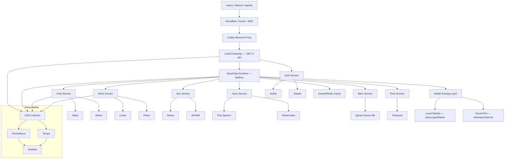
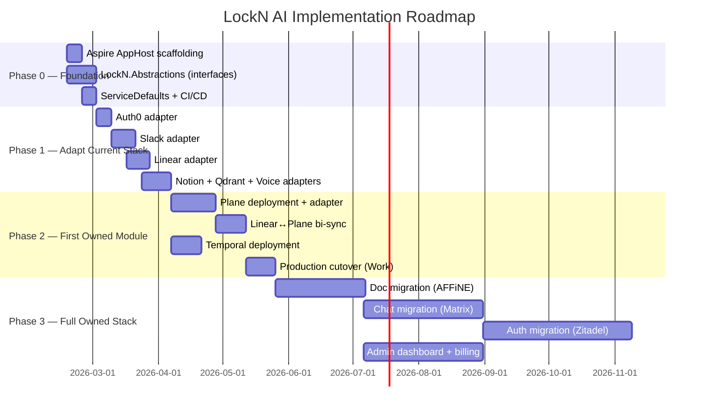

# LockN AI — Complete Product Handoff Report

> **The Self-Hostable Agentic Operating System**

**Version:** 1.0  
**Date:** February 11, 2026  
**Prepared by:** LockN Labs  
**Audience:** Product Team, Engineering Leadership, Investors  
**Classification:** Internal — Confidential

---

## Table of Contents

- [I. Executive Summary](#i-executive-summary)
- [II. Vision & Positioning](#ii-vision--positioning)
- [III. Product Architecture](#iii-product-architecture)
- [IV. Ecosystem Inventory](#iv-ecosystem-inventory)
- [V. Technical Roadmap](#v-technical-roadmap)
- [VI. Go-to-Market Strategy](#vi-go-to-market-strategy)
- [VII. Competitive Analysis](#vii-competitive-analysis)
- [VIII. Key Decisions Required](#viii-key-decisions-required)
- [IX. Appendices](#ix-appendices)

---

# I. Executive Summary

## What Is LockN AI?

LockN AI is a **fully self-hostable agentic operating system** — a unified platform that replaces 8+ separate SaaS tools (Slack, Auth0, Linear, Notion, LangChain, etc.) with a single, integrated, provider-agnostic stack. It combines an AI agent runtime, communications, identity, project management, knowledge management, voice, vector memory, workflow orchestration, and observability into one deployable platform.

Unlike competitors that either sell frameworks without infrastructure (LangChain, CrewAI) or parasitize existing SaaS tools (Dust.tt, Relevance AI), LockN AI **owns the full operational stack**. Nobody else in the market does this.

## Why Now?

- The agentic AI market is **$7.8 billion in 2025**, growing to **$52–139 billion by 2030–2034** (40–46% CAGR)
- Gartner predicts **40% of enterprise applications will include AI agents by end of 2026** — up from <5% in 2025
- Simultaneously, **>40% of agentic AI projects will fail** (Gartner) — primarily due to infrastructure fragility
- Enterprise demand for **data sovereignty and self-hostability** is accelerating under GDPR, the EU AI Act, and growing distrust of SaaS data practices
- No competitor occupies the "enterprise-ready + fully self-hostable + owns full stack" position — this is a genuine blue ocean

## Key Numbers

| Metric | Value |
|--------|-------|
| Market size (2025) | $7.8B |
| Market size (2030 projected) | $52–139B |
| CAGR | 40–46% |
| Running containers today | 30+ |
| Custom skills built | 27 |
| Agent configurations | 20 |
| Autonomous cron jobs | 29+ |
| Current monthly burn | ~$420 |
| Platform readiness | ~45% toward full vision |
| Time to MVP (Phase 0+1) | 6–9 weeks |
| Time to first owned module in production | 14–17 weeks |
| Competitor funding raised (combined) | >$350M |

## Top 3 Strategic Recommendations

1. **Build the abstraction layer first (Phase 0–1, 6–9 weeks).** Wrap the existing Auth0/Slack/Linear/Notion stack behind provider interfaces. This de-risks everything downstream and enables "BYO provider" packaging immediately.

2. **Migrate Work (Linear → Plane) as the first owned module.** Highest value, lowest risk, clearest sync strategy. This proves "owned stack" positioning to customers without touching identity (Auth) or comms (Chat), which carry higher migration risk.

3. **Launch with open-core + self-hosted premium positioning.** Open-source the OpenClaw runtime to build community. Monetize commercial modules (enterprise auth, audit, multi-tenancy) and self-hosted deployment at $49–499/month. This positions against both free frameworks (LangChain/CrewAI) and expensive cloud-only platforms (Dust/Retool).

---

# II. Vision & Positioning

## Mission Statement

> **Empower every organization to own their AI infrastructure — not rent it.**

LockN AI exists because the current AI landscape forces companies into a false choice: use disconnected SaaS tools that leak data everywhere, or build everything from scratch. LockN AI is the third option — a complete, integrated, self-hostable platform where your agents run on your infrastructure, your data never leaves your network, and you're never locked into a single vendor.

## Product Positioning

**One-liner:**
> LockN AI is the self-hostable agentic operating system that lets you own your AI infrastructure instead of renting it from 8 different SaaS vendors.

**Elevator Pitch (30 seconds):**
> Most companies building with AI are cobbling together 8 different SaaS tools — LangChain for agents, Slack for comms, Notion for docs, Auth0 for identity. Every integration breaks. Every bill is separate. Your data goes everywhere.
>
> LockN AI is different. It's a complete agentic operating system — runtime, comms, auth, work management, knowledge base — all in one platform. And unlike every competitor, you can self-host it. Your agents run on your infrastructure. Your data never leaves your network. One platform, one bill, zero lock-in.

## The "10x Better" Narrative

| Dimension | Traditional (8 SaaS Tools) | LockN AI |
|-----------|---------------------------|----------|
| Setup time | 6+ months | 1 day (`docker-compose up`) |
| Monthly cost | $200–500/user | $49–499 flat (unlimited users in self-host) |
| Integration maintenance | 2 engineers full-time | Zero (single platform) |
| Compliance scope | 8 separate audits | 1 audit scope |
| Vendor lock-in | Total | None (source available, provider-agnostic) |
| Data residency | Impossible (data in 8+ places) | Full control |

**10x faster** to production. **10x cheaper** at scale. **10x simpler** compliance.

## Competitive Landscape Summary

```
                    Owns Infrastructure
                    Low              High
                   ┌─────────────────────────┐
      High         │ Dust.tt          ┌─────┐│
    Enterprise     │ Relevance AI     │LOCKN││
      Ready        │ Retool           │ AI  ││
                   │                  └─────┘│
                   ├─────────────────────────┤
      Low          │ LangChain              ││
     Framework     │ CrewAI                 ││
      Only         │ AutoGen               ││
                   └─────────────────────────┘
                    Cloud-Only ← → Self-Hostable
```

**LockN AI occupies the only empty quadrant:** enterprise-ready, fully self-hostable, full infrastructure ownership. Every other player is either cloud-only (Dust, Relevance, Retool) or framework-only without operational infrastructure (LangChain, CrewAI, AutoGen).

---

# III. Product Architecture

## Module Map

LockN AI is composed of 11 core modules spanning runtime, platform services, intelligence, and vertical products. Each module has a **provider abstraction** — a clean interface that allows swapping the underlying implementation without changing business logic.

| Module | Purpose | Current Provider | Target Provider | Status |
|--------|---------|-----------------|-----------------|--------|
| **Bot** | AI agent runtime & orchestration | OpenClaw (proprietary) | Same (enhance) | ██████████ 95% |
| **Chat** | Messaging & communications | Slack | Matrix (owned) | ████████░░ 80% |
| **Auth** | Identity, authorization, multi-tenancy | Auth0 | Zitadel (owned) | ██████████ 90% |
| **Work** | Project/issue management | Linear | Plane (owned) | ████████░░ 80% |
| **Doc** | Knowledge base & documents | Notion | AFFiNE (owned) | ██████░░░░ 60% |
| **Mem** | Vector memory & semantic search | Qdrant | Same (harden) | ██████████ 90% |
| **Flow** | Durable workflow orchestration | — | Temporal | ░░░░░░░░░░ 0% |
| **Watch** | Observability (traces, metrics, logs) | OTel + Grafana + Logger | Unified OTel | ██████░░░░ 65% |
| **Voice** | Text-to-speech & speech-to-text | Fish Speech + Chatterbox + Qwen3 + Whisper | Same + abstraction | ████████░░ 80% |
| **Net** | Infrastructure & deployment | Caddy + Docker + Cloudflare | Same (codify) | ██████████ 95% |
| **Arch** | Architecture diagrams (as code) | — | D2 + Mermaid | ░░░░░░░░░░ 0% |

### Vertical Products (built on the platform)

| Product | Description | Status |
|---------|-------------|--------|
| **LockN Score** | AI sports scoring (vision + audio fusion) | ████████░░ Near-production |
| **LockN Swap** | XRPL trading (arbitrage + ML swing) | ██████████ Production |
| **LockN Gen** | Generative media UI | ██░░░░░░░░ Early |

## What Exists Today

**Infrastructure is remarkably mature.** 30+ Docker containers are running in production across a Threadripper workstation with an RTX Pro 6000 Ada (48GB VRAM). The intelligence layer (Brain, Sense, Mem), voice stack (3 TTS engines + STT), and agent operations (27 skills, 20 agent configs, 29+ cron jobs) are all operational.

**What's missing** is the abstraction layer (provider interfaces at 0%), owned module replacements (Matrix, Zitadel, Plane, AFFiNE — all at 0%), and the customer-facing shell (no admin UI, no billing, no docs site, no self-hosted installer).

**Overall platform readiness: ~45%** toward the full productized vision. The foundation is solid; the productization wrapper needs building.

## .NET Aspire Orchestration Overview

LockN AI uses **.NET Aspire** as its orchestration backbone. For non-engineers: Aspire is a framework from Microsoft that lets you define your entire system — all services, databases, and infrastructure — in a single configuration file, then start everything with one command.

**Why this matters to product:**
- **One-command developer onboarding:** `dotnet run` boots the entire platform locally
- **Service discovery built-in:** Services find each other automatically, no manual configuration
- **Observability by default:** Every service gets traces, metrics, and logs automatically
- **Same code, multiple deploy targets:** Local Docker, Kubernetes, cloud — same module definitions

**How it works:**
1. The **AppHost** project defines every service and its dependencies
2. **ServiceDefaults** package injects standard health checks, telemetry, and resilience patterns into every service
3. .NET services become Aspire **projects**; Python, Node.js, and infrastructure (Qdrant, Temporal, etc.) become Aspire **container resources**
4. Configuration flows through Aspire — provider selection (`Provider=slack|matrix`) is a config switch, not a code change

## Provider Abstraction Pattern

This is the architectural keystone of LockN AI, explained simply:

**The Problem:** Today, the bot directly calls Slack's API, Linear's API, Notion's API, etc. If we want to replace Slack with Matrix, we'd need to rewrite every place that touches Slack.

**The Solution:** Insert a clean interface between the bot and the providers. The bot calls `ILocknChat.SendMessage()` — it doesn't know or care whether that goes to Slack or Matrix. Swapping providers is a configuration change, not a code change.

```
Before:  Bot → Slack API (direct coupling)
After:   Bot → ILocknChat → SlackProvider (or MatrixProvider)
```

Each module has its own interface: `ILocknChat`, `ILocknAuth`, `ILocknWork`, `ILocknDoc`, `ILocknMem`, `ILocknFlow`, `ILocknVoice`, `ILocknArch`. These interfaces define what operations are possible (send message, create issue, search documents) without specifying how they're implemented.

**Why this matters to product:**
- Enables **"BYO Provider"** packaging — customers keep their Slack/Linear/Notion
- Enables **gradual migration** — switch one module at a time, roll back if needed
- Enables **competitive differentiation** — we're provider-agnostic, competitors aren't
- Reduces risk — if any OSS replacement disappoints, swap without architectural changes

## System Architecture Diagram



---

# IV. Ecosystem Inventory

## Running Services (30+ Containers)

Every container listed below is **currently running** in production:

| Container | Module | Technology | Purpose |
|-----------|--------|------------|---------|
| `lockn-auth-api` | Auth | .NET / Auth0 | Authentication & authorization |
| `lockn-brain` | Brain | AI inference | Local AI inference + RAG |
| `lockn-caddy` | Net | Caddy | Reverse proxy & TLS |
| `lockn-chatterbox` | Voice | Chatterbox TTS | Voice cloning TTS engine |
| `lockn-cloudflared` | Net | Cloudflare | Tunnel to public internet |
| `lockn-email-api` | Platform | Email service | Transactional email |
| `lockn-git` | Platform | Git service | Source code management |
| `lockn-grafana` | Watch | Grafana | Dashboards & alerting |
| `lockn-logger-api` | Watch | .NET 9 | AI agent cost/usage logging |
| `lockn-logger-garnet` | Watch | Garnet | Cache for logger |
| `lockn-logger-postgres` | Watch | PostgreSQL | Logger persistence |
| `lockn-logger-seaweedfs` | Watch | SeaweedFS | Object storage for logs |
| `lockn-otel-collector` | Watch | OTel Collector | Telemetry collection |
| `lockn-panns` | Sense | PANNs | Audio classification |
| `lockn-platform-api` | Platform | .NET | Core platform API |
| `lockn-qdrant` | Mem | Qdrant | Vector database |
| `lockn-qwen3-tts` | Voice | Qwen3 TTS | Third TTS engine |
| `lockn-score-api` | Score | Python | Sports scoring API |
| `lockn-score-web` | Score | React | Sports scoring frontend |
| `lockn-speak-api` | Voice | Fish Speech 1.5 | Primary TTS engine |
| `lockn-speak-db` | Voice | Database | Voice model storage |
| `lockn-swagger` | Platform | Swagger | API documentation |
| `lockn-tempo` | Watch | Tempo | Distributed tracing |
| `lockn-whisper-gpu` | Voice | Whisper | GPU-accelerated STT |

## What's Productizable Today

### Tier 1 — Ready to package and sell now

| Product | Why It's Ready | Unique Value |
|---------|---------------|--------------|
| **LockN Score** | React + Python API running, demo-ready | AI vision + audio fusion for sports scoring — no competitor does multimodal |
| **LockN Speak** | 3 TTS engines running | Voice cloning + multi-engine TTS with cost optimization, fully self-hosted |
| **LockN Brain** | Container running, RAG pipeline proven | Local-first AI inference with smart routing — privacy-first AI |
| **LockN Logger** | Full stack running (.NET 9 + PG + SeaweedFS + Garnet) | AI agent cost attribution and tool-usage logging — unique product for AI governance |

### Tier 2 — Packageable within 2–4 weeks

| Product | What's Needed |
|---------|---------------|
| **LockN Sense** | API documentation + packaging |
| **LockN Swap** | Pricing portal (already production) |
| **LockN Watch** | Consolidate Logger into OTel; dashboard templates |

## The OpenClaw Proprietary Layer — The Secret Sauce

The real product isn't the individual containers — it's the **orchestration intelligence** that ties them together. This lives entirely in the OpenClaw customization layer and represents 6+ months of iterative development.

### Why competitors can't replicate this

**1. Full-stack ownership.** Nobody in the agentic AI space owns comms + auth + PM + knowledge + voice + inference. Dust.tt parasitizes Slack/Notion. CrewAI/AutoGen are frameworks without operational infrastructure.

**2. Autonomous business operations.** 29+ cron jobs run revenue triage, competitive intelligence, architecture analysis, infrastructure monitoring, and document organization — continuously, without human prompting. This is an AI employee, not a chatbot.

**3. Multi-model cost optimization.** Automatic routing between Opus (high-stakes reasoning), Codex (coding), DeepSeek (bulk work) based on task complexity. Saves 60–80% vs. running everything through a single premium model.

**4. Memory continuity.** MEMORY.md + daily logs + corrections register + promise tracker creates genuine agent continuity across sessions. The corrections register is particularly novel: when the agent discovers a stale fact, it logs a SUPERSEDES entry that overrides future memory searches. This solves the "RAG returns outdated information" problem.

**5. Shared platform infrastructure.** LockN Score, Swap, and Gen share the same platform services. Each new vertical product gets perception, memory, and voice for free — a compounding moat.

### IP inventory

| Category | Count | Examples |
|----------|-------|---------|
| Custom skills | 27 | coding-pipeline, complexity-router, dual-process, revenue-triage, ux-regression |
| Agent configurations | 20 | main, orchestrator, dev, research-cloud, ux-lead, finance-review |
| Autonomous cron jobs | 29+ | Infrastructure monitoring (15min), revenue triage (3x daily), C-suite reviews (weekly), architecture analysis (nightly) |
| Process frameworks | 7 | Boot checks, heartbeat system, promise tracker, session handoff, atomic write-through, subagent isolation, failure-loud rule |
| Model routing tiers | 5 | Opus → Codex → A3B → DeepSeek → Local |

---

# V. Technical Roadmap

## Phase Overview



## Phase 0 — Foundation (Weeks 1–3)

**Goal:** Create the stable platform shell where all modules are plug-replaceable.

| Deliverable | Description | Effort |
|-------------|-------------|--------|
| Aspire AppHost | Orchestrator defining all services + infrastructure containers | 1 week |
| `LockN.Abstractions` | Provider interfaces (`ILocknChat`, `ILocknAuth`, etc.) + DTOs + events | 2 weeks |
| ServiceDefaults | OTel, health checks, resilience, auth middleware — auto-injected into every service | 1 week |
| CI/CD golden path | Build/test/lint + contract conformance tests | 1 week |

**Exit criteria:** A demo scenario runs through interfaces: user command → bot → work/chat/doc call → telemetry visible in Grafana.

## Phase 1 — Adapt Current Stack (Weeks 4–9)

**Goal:** Keep existing behavior identical, but all calls route through provider interfaces. No more direct SDK calls from the bot.

| Adapter | Estimate | Complexity | Risk |
|---------|----------|------------|------|
| Auth0 → `ILocknAuth` | 4–6 days | Medium | Medium |
| Slack → `ILocknChat` | 5–8 days | Medium | Medium |
| Linear → `ILocknWork` | 5–8 days | Medium | Medium |
| Notion → `ILocknDoc` | 6–10 days | Medium-High | Medium |
| Qdrant → `ILocknMem` | 3–5 days | Small-Medium | Low |
| Voice → `ILocknVoice` | 2–4 days | Small | Low |

**Exit criteria:** Regression suite proves parity. Bot runtime uses only interfaces. Provider swap is a config change.

## Phase 2 — First Owned Module (Weeks 10–17)

**First module: LockN Work (Linear → Plane)**

Why Plane first:
- Highest customer-visible value with manageable risk
- Work items are structured and sync-friendly
- Clear bi-directional sync strategy with idempotency keys
- Proves "owned stack" positioning without touching identity or comms

**Parallel: Deploy Temporal** for durable workflow orchestration (needed for migration pipelines and cross-module operations).

| Step | Description | Duration |
|------|-------------|----------|
| Deploy Plane | Self-hosted Plane instance + configuration | 1 week |
| Build PlaneProvider | `ILocknWork` implementation for Plane | 2 weeks |
| Bi-directional sync | Linear ↔ Plane webhook-driven sync with idempotency | 2 weeks |
| Shadow mode | Plane mirrors Linear; verify parity >99% | 1 week |
| Production cutover | Switch primary to Plane; Linear becomes read-only fallback | 1 week |
| Rollback verified | One-click revert to Linear confirmed | 1 week |

## Phase 3 — Full Owned Stack (Months 5–11)

| Migration | Timeline | Effort | Risk | Strategy |
|-----------|----------|--------|------|----------|
| **Doc: Notion → AFFiNE** | Months 5–6 | Large | Medium-High | Batch export → transform → delta sync → human validation → cutover |
| **Chat: Slack → Matrix** | Months 7–8 | Large | High | Deploy Matrix + mautrix-Slack bridge → dual-write → gradual channel migration |
| **Auth: Auth0 → Zitadel** | Months 9–11 | XL | High | Parallel IdP → auth broker accepts both tokens → pilot cohorts → flip default issuer |
| **Admin Dashboard** | Months 7–8 | Large | Medium | Unified UI for tenant/module/agent management |
| **Billing (Stripe)** | Month 8 | Medium | Low | Subscription management + usage metering |

### Migration Order Rationale

1. **Work first** — Lowest risk, highest visibility, best proof of "owned stack"
2. **Doc second** — Content migration is complex but non-critical-path
3. **Chat third** — Matrix bridges enable graceful transition
4. **Auth last** — Highest risk; only attempt after 2 successful migrations and platform maturity

## Critical Path

The critical path runs through:

```
Net baseline → Abstractions → Watch defaults → Auth adapter → Flow skeleton → Bot integration
```

If any of these slip, all downstream module migrations slip. The abstraction layer (Phase 0–1) is the single biggest dependency.

## Risk Analysis

| Risk | Severity | Likelihood | Mitigation |
|------|----------|------------|------------|
| Abstraction layer takes longer than estimated | High | Medium | Start with thin interfaces; iterate. Ship MVP contracts, not perfect ones. |
| Auth migration causes downtime | Critical | Medium | Auth broker pattern (accept tokens from both IdPs). Rehearse rollback. Auth migrates last. |
| Chat bridge loses messages | High | Medium | Dual-write with dedup IDs. Keep Slack as source-of-truth flag until confidence is high. |
| Doc content fidelity loss | Medium | Medium | Human validation window for high-value docs. Keep Notion read-only fallback. |
| Temporal learning curve | Medium | Medium | Start with 3 simple workflows. Abstract away for 80% use case. |
| Team bandwidth | High | High | Phase migrations sequentially, not in parallel. Max 1 migration active at a time. |
| Enterprise SSO edge cases in Zitadel | Medium | Medium | Build SSO test matrix early. Pilot with internal use first. |

---

# VI. Go-to-Market Strategy

## Target Customer Personas

### Persona 1: The Overwhelmed Engineering Manager — "Alex"

- **Who:** VP of Engineering, 50–500 person tech company, manages 10–30 engineers
- **Pain:** Team drowning in operational toil. AI experiments aren't productionizing. 8+ SaaS bills. GDPR compliance gaps.
- **Trigger:** Budget season, major incident from human error, post-security audit
- **Modules:** Bot, Work, Doc, Watch
- **Message:** "Automate 30%+ of operational work. Own your infrastructure."

### Persona 2: The AI-Native Founder — "Jordan"

- **Who:** CTO/Co-founder, seed/Series A startup, 5–20 employees
- **Pain:** Can't afford 5 SaaS subscriptions. Needs to ship AI features fast. Worried about vendor lock-in.
- **Trigger:** Preparing for Series A, first customer demand for AI features
- **Modules:** Bot, Chat, Mem, Flow, Voice
- **Message:** "One platform, one bill. Scale from 10 to 1,000 users without replatforming."

### Persona 3: The Enterprise Architect — "Sam"

- **Who:** Principal Architect, Fortune 500, 10,000+ employees
- **Pain:** Every AI vendor needs 6-month security review. Shadow AI everywhere. Regulatory pressure.
- **Trigger:** C-level AI mandate, failed AI pilot, compliance audit findings
- **Modules:** Auth, Net, Watch, Flow, Doc
- **Message:** "Run on-premise. Full audit trail. Single compliance scope."

### Persona 4: The DevOps/Infrastructure Lead — "Taylor"

- **Who:** Senior SRE, mid-market to enterprise platform team
- **Pain:** Flaky automation scripts. Unobservable AI systems. Spiraling inference costs.
- **Trigger:** Post-incident review, new platform strategy initiative, OpenAI bill shock
- **Modules:** Bot, Watch, Flow, Net, Mem
- **Message:** "AI-native observability. Cost tracking per agent. Kubernetes-native."

## Pricing Tiers

| Tier | Price | Target | Agents | Key Features |
|------|-------|--------|--------|--------------|
| **Starter** (Cloud) | $49/mo | Individual devs, POCs | Up to 3 | Basic integrations, community support, 1GB vector storage |
| **Team** (Cloud) | $199/mo | Engineering teams, 10–50 person companies | Up to 15 | All integrations, priority email support, 10GB vector, Grafana dashboards |
| **Business** (Self-Hosted) | $499/mo | Startups, mid-market, compliance-conscious | Up to 50 | All modules, SSO/SAML, audit logging, BYO model endpoints, 1-year retention |
| **Enterprise** (Self-Hosted) | $20K+/yr | Fortune 500, regulated industries | Unlimited | White-glove onboarding, 24/7 support, custom SLA, air-gapped option |

**Self-hosted premium ($200/mo surcharge over cloud equivalent):** Justified by higher support burden and the real compliance value of data residency.

**Free tier:** 1 agent, 100 requests/day, 7-day retention. Goal: community adoption → commercial conversion.

### Alternative Packaging Options

| Package | Price | Target |
|---------|-------|--------|
| **Developer Bundle** (Bot + Work + Doc + Mem) | $149/mo | Developers building AI-native apps |
| **Ops Bundle** (Bot + Watch + Flow + Net) | $199/mo | DevOps/SRE teams |
| **BYO Provider** (Runtime + connectors) | $99 + $25/connector | Companies keeping existing SaaS |
| **White-Label / OEM** | $5K–20K/mo | Agencies, ISVs, MSPs |

## Revenue Projections (12 Months)

| Scenario | Month 1 MRR | Month 6 MRR | Month 12 MRR | Year 1 Total |
|----------|-------------|-------------|--------------|--------------|
| **Pessimistic** | $500 | $3,000 | $8,540 | $51K |
| **Base** | $1,000 | $13,760 | $49,920 | $294K |
| **Optimistic** | $2,000 | $40,200 | $206,400 | $1.16M |

**Key assumptions:**
- Pessimistic: Slow organic growth, no enterprise deals
- Base: Moderate community adoption, 2–3 enterprise contracts
- Optimistic: Viral OSS adoption, 5 enterprise deals ($20K+ each)

**Current burn:** ~$420/mo (infrastructure only — no payroll). Break-even at ~5 paying customers.

## Launch Phases

| Phase | Timeline | Goal | Key Activities |
|-------|----------|------|----------------|
| **Developer/Early Adopter** | Months 1–6 | 100 developers, 10 paying teams | GitHub launch, HN "Show HN," docs sprint, Discord community, YouTube tutorials |
| **SMB Adoption** | Months 4–12 | $10K MRR, 50 customers | Case studies, comparison content, self-hosted GA, Product Hunt, partner program |
| **Enterprise** | Months 9–18 | $50K MRR, 5 enterprise customers | First AE hire, SOC 2 pursuit, paid POCs ($10K/30 days), executive briefings |

## Sales Narrative & Objection Handling

| Objection | Response |
|-----------|----------|
| **"Why not just use Slack + Linear + Notion?"** | You can — and keep them. LockN augments, then gradually replaces as you're ready. But when compliance, cost, or control matter, LockN is the only path to ownership. |
| **"This looks complex"** | Cloud: 5 minutes to first agent. Self-hosted: `docker-compose up`. We did the hard integration work so you don't have to. |
| **"LangChain/CrewAI is free"** | Free to download, but productionizing costs 6+ months of engineering. LockN saves that time. |
| **"We're invested in [competitor]"** | No rip-and-replace required. Start with one agent. Use bridges for interop. Migrate as contracts expire. |

---

# VII. Competitive Analysis

## Detailed Competitor Map

| Competitor | Type | Funding | Pricing | Self-Host | Key Strength | Key Weakness |
|-----------|------|---------|---------|-----------|--------------|--------------|
| **Dust.tt** | SaaS Platform | $21.6M (Sequoia) | $29/user/mo | ❌ | Strong Slack integration, SOC 2 | Parasitizes SaaS, cloud-only |
| **Relevance AI** | SaaS Platform | ~$10–20M | $29–349/mo | ❌ | 2,000+ integrations | Complex credit-based pricing |
| **Retool** | Low-code Platform | $140M+ ($1.9B val) | $10–50/user/mo | Partial | Mature enterprise adoption | Apps-first, not agents-first |
| **LangChain/LangGraph** | Framework + Cloud | $160M+ ($1.25B val) | $39/user + usage | Partial | 118K GitHub stars, de facto standard | Framework only, expensive at scale |
| **CrewAI** | Framework | $18M | Free + cloud | ✅ (framework) | Simple mental model | No infrastructure |
| **AutoGen** | Framework | N/A (Microsoft) | Free | ✅ (framework) | Microsoft backing | Research project, no infrastructure |
| **Composio** | Integration Layer | Undisclosed | Custom | Partial | 90+ agent tools | Just integrations, not a platform |
| **Wordware** | AI Dev Tool | $30M (YC) | Freemium | ❌ | Natural language programming | Niche prompt engineering focus |
| **Superagent.sh** | Vertical AI | Undisclosed | Token-based | ❌ | Insurance/finance focus | Extremely narrow |

## Feature Comparison Matrix

| Capability | LockN AI | Dust.tt | Relevance | LangGraph | CrewAI |
|-----------|----------|---------|-----------|-----------|--------|
| Full self-hostability | ✅ | ❌ | ❌ | Partial | Framework only |
| Owned comms layer | ✅ (Matrix) | ❌ (Slack) | ❌ (Slack) | ❌ | ❌ |
| Owned auth/identity | ✅ (Zitadel) | ❌ | ❌ | ❌ | ❌ |
| Owned project management | ✅ (Plane) | ❌ | ❌ | ❌ | ❌ |
| Owned knowledge base | ✅ (AFFiNE) | ❌ (Notion) | ❌ | ❌ | ❌ |
| Voice (TTS + STT) | ✅ (3 engines) | ❌ | ❌ | ❌ | ❌ |
| Multimodal perception | ✅ (vision + audio) | ❌ | ❌ | ❌ | ❌ |
| Multi-model routing | ✅ (5 tiers) | Partial | Partial | Partial | Partial |
| Durable workflows | ✅ (Temporal) | ❌ | ❌ | ✅ | ❌ |
| Autonomous operations | ✅ (29+ cron jobs) | ❌ | ❌ | ❌ | ❌ |
| Observability built-in | ✅ (OTel + Grafana) | ❌ | ❌ | ✅ (LangSmith) | ❌ |
| Vertical products | ✅ (Score, Swap) | ❌ | ❌ | ❌ | ❌ |
| Source available | ✅ | ❌ | ❌ | ✅ | ✅ |

## Blue Ocean Positioning

LockN AI doesn't compete head-to-head with any existing player. It creates a new category:

- **Frameworks** (LangChain, CrewAI) help you *build* agents. LockN gives you a place to *run* them.
- **SaaS platforms** (Dust, Relevance) run your agents in *their* cloud. LockN runs them in *yours*.
- **Tool builders** (Retool) think *apps* first. LockN thinks *agents* first.

## Defensible Moat

| Moat Layer | Description | Time to Replicate |
|-----------|-------------|-------------------|
| **Full-stack integration** | 30+ services, all integrated and tested together | 12–18 months |
| **Orchestration IP** | 27 skills, 20 agent configs, 29 cron jobs — encoded domain expertise | 6–12 months |
| **Provider abstraction** | Clean swap between providers — no other platform offers this | 6 months |
| **Memory continuity system** | Corrections register, promise tracker, multi-layer memory | 3–6 months |
| **Multi-model routing** | Automatic cost optimization across 5+ model tiers | 3 months |
| **Vertical product flywheel** | Each new vertical gets platform capabilities for free | Compounds over time |

---

# VIII. Key Decisions Required

## Decisions for the Product Team

| # | Decision | Options | Recommendation | Urgency |
|---|----------|---------|---------------|---------|
| 1 | **License for OpenClaw runtime** | MIT / Apache 2.0 / AGPL / BSL / Proprietary source-available | Apache 2.0 for runtime; proprietary for commercial modules. Review at 6 months. | High — blocks launch |
| 2 | **Module open/commercial boundaries** | What stays open vs. commercial? | Open: Bot runtime, basic tools. Commercial: SSO/SAML, enterprise audit, multi-tenancy, professional services. | High |
| 3 | **Migration order confirmation** | Various sequences possible | Work → Doc → Chat → Auth (recommended) | Medium |
| 4 | **Cloud vs. self-host engineering priority** | Cloud-first / self-host-first / split | 60/40 self-host priority (stronger differentiation) | Medium |
| 5 | **Vertical product strategy** | Unified platform / separate products / modules | Technically modules, marketed as one platform ("LockN Score powered by LockN AI") | Medium |
| 6 | **Fundraising vs. bootstrapping** | Raise now / bootstrap to traction / hybrid | Bootstrap to $5K MRR or 6 months, then raise on traction | Low (current burn is ~$420/mo) |

## Decisions Requiring Sean's Call

| # | Decision | Context |
|---|----------|---------|
| 1 | Final migration order | Recommended: Work → Doc → Chat → Auth. Auth should only migrate after 2 successful owned-module launches. |
| 2 | Acceptable parity gaps during hybrid transitions | Some provider-specific features may be "compatibility mode" temporarily. What's the quality bar? |
| 3 | BYO vs. managed module packaging | Offer both? Or lead with one? Pricing implications differ significantly. |
| 4 | Self-hosted support scope | Best-effort community? Validated environments only (Docker/K8s)? Full support? Recommendation: validated environments only. |

## Open Questions

1. Should we prioritize a "killer app" vertical (e.g., Score for sports organizations) to drive awareness?
2. What's the fallback if self-hosted positioning resonates less than expected?
3. What's our response if OpenAI releases a "workspace" product that directly competes?
4. When should we target international expansion (EU data centers)?
5. What's the Temporal abstraction level? Full abstraction (users never see it) vs. optional visibility for power users?

## Trade-offs Requiring Alignment

| Trade-off | Option A | Option B | Impact |
|-----------|----------|----------|--------|
| Speed vs. completeness | Ship thin interfaces, iterate | Ship comprehensive interfaces | A = faster to market, more rework. B = slower, cleaner. |
| Cloud revenue vs. differentiation | Cloud-first (easier revenue) | Self-host-first (stronger differentiation) | A = faster MRR. B = stronger competitive position. |
| Open source breadth | Give away more (max adoption) | Keep more commercial (protect revenue) | A = more users, harder monetization. B = fewer users, clearer revenue. |
| Migration pace | Parallel migrations (faster) | Sequential (safer) | A = done sooner, higher risk. B = done later, lower risk. |

---

# IX. Appendices

## Appendix A: Module Detail Cards

### A.1 LockN Bot (OpenClaw Runtime)

| Attribute | Value |
|-----------|-------|
| **Current State** | Node.js runtime, 27 skills, 20 agent configs, 29+ cron jobs |
| **Status** | ██████████ 95% |
| **Technology** | Node.js, multi-model routing |
| **Key Interface** | `ExecuteTask()`, `DispatchToolCall()`, `PublishEvent()` |
| **Migration** | Incremental strangler — route one capability at a time through interfaces |
| **Risk** | Medium |
| **Dependencies** | Auth, Watch, Flow, all provider interfaces |

### A.2 LockN Chat

| Attribute | Value |
|-----------|-------|
| **Current Provider** | Slack |
| **Target Provider** | Matrix (Dendrite) + Slack bridge |
| **Status** | ████████░░ 80% |
| **Key Interface** | `ILocknChat` — SendMessage, ReadMessages, React, channels, threads, presence |
| **Migration** | Bridge pattern: deploy Matrix → mautrix-Slack bridge → dual-write → gradual cutover |
| **Effort** | Large (6–10 weeks) |
| **Risk** | High (thread/reaction semantics, bridge reliability) |

### A.3 LockN Auth

| Attribute | Value |
|-----------|-------|
| **Current Provider** | Auth0 |
| **Target Provider** | Zitadel (Apache 2.0, event-sourced, multi-tenant native) |
| **Status** | ██████████ 90% |
| **Key Interface** | `ILocknAuth` — Authenticate, ValidateToken, Authorize, agent identity, delegation grants, multi-tenancy |
| **Migration** | Parallel IdP → auth broker → phased audience migration → flip default issuer |
| **Effort** | XL (8–12 weeks) |
| **Risk** | High (zero-downtime requirement, enterprise SSO edge cases) |

### A.4 LockN Work

| Attribute | Value |
|-----------|-------|
| **Current Provider** | Linear |
| **Target Provider** | Plane (AGPL + commercial license, ~30K GitHub stars) |
| **Status** | ████████░░ 80% |
| **Key Interface** | `ILocknWork` — CreateIssue, UpdateIssue, ListIssues, projects, cycles, labels, comments, webhooks |
| **Migration** | Bi-directional sync with idempotency keys → shadow mode → workspace cutover |
| **Effort** | Medium-Large (6–8 weeks) |
| **Risk** | Medium |

### A.5 LockN Doc

| Attribute | Value |
|-----------|-------|
| **Current Provider** | Notion |
| **Target Provider** | AFFiNE (MIT, local-first, CRDT) |
| **Status** | ██████░░░░ 60% |
| **Key Interface** | `ILocknDoc` — CreateDocument, UpdateDocument, Search, blocks, templates |
| **Migration** | Batch export → schema transform → delta sync → human validation → cutover |
| **Effort** | Large (6–10 weeks) |
| **Risk** | Medium-High (rich content fidelity, AFFiNE API maturity) |

### A.6 LockN Mem

| Attribute | Value |
|-----------|-------|
| **Current Provider** | Qdrant (staying) |
| **Status** | ██████████ 90% |
| **Key Interface** | `ILocknMem` — collections, upsert, search (with auto-embedding), embed |
| **Migration** | Hardening only — multi-tenant isolation, TTL policies, embedding governance |
| **Effort** | Medium |
| **Risk** | Medium |

### A.7 LockN Flow

| Attribute | Value |
|-----------|-------|
| **Current State** | No workflow engine deployed |
| **Target Provider** | Temporal (MIT license) |
| **Status** | ░░░░░░░░░░ 0% |
| **Key Interface** | `ILocknFlow` — StartWorkflow, SignalWorkflow, QueryWorkflow, CancelWorkflow |
| **Migration** | New deployment. Move high-value flows first (sync pipelines, migrations). |
| **Effort** | Large |
| **Risk** | Medium |

### A.8 LockN Watch

| Attribute | Value |
|-----------|-------|
| **Current State** | OTel Collector + Grafana + Prometheus + Tempo + separate Logger service |
| **Target** | Unified OTel stack with golden dashboards |
| **Status** | ██████░░░░ 65% |
| **Key Interface** | Standard OTel instrumentation + custom meters (`LockN.Chat`, `LockN.Auth`, etc.) |
| **Migration** | Consolidate Logger into unified OTel pipeline. Build golden dashboards. |
| **Effort** | Medium |
| **Risk** | Low-Medium |

### A.9 LockN Voice

| Attribute | Value |
|-----------|-------|
| **Current State** | Fish Speech 1.5 + Chatterbox + Qwen3 TTS (speak) + Whisper GPU (listen) |
| **Status** | ████████░░ 80% |
| **Key Interface** | `ILocknVoice` — Synthesize, ListVoices, GetLatencyProfile |
| **Migration** | Add provider abstraction + quality A/B testing + ElevenLabs fallback |
| **Effort** | Medium |
| **Risk** | Medium |

### A.10 LockN Net

| Attribute | Value |
|-----------|-------|
| **Current State** | Caddy + Docker + Cloudflare tunnel — all running |
| **Status** | ██████████ 95% |
| **Key Interface** | `ILocknNet` — ProvisionRoute, RotateCert, DeployService, GetHealth |
| **Migration** | Codify into Aspire profiles for one-command environment bootstrap |
| **Effort** | Large |
| **Risk** | Medium-High |

### A.11 LockN Arch

| Attribute | Value |
|-----------|-------|
| **Current State** | Ad-hoc diagrams |
| **Target** | D2 (MPL-2.0) + Mermaid (MIT) — generated from contracts/topology |
| **Status** | ░░░░░░░░░░ 0% |
| **Key Interface** | `ILocknArch` — Render, SaveDiagram, Validate |
| **Effort** | Small-Medium |
| **Risk** | Low |

## Appendix B: C# Interface Summary

The full interface contracts are defined in `LockN.Abstractions` and total ~2,000 lines of C#. Key patterns:

| Interface | Methods | Models | Events |
|-----------|---------|--------|--------|
| `ILocknChat` | 14 (channels, messages, threads, reactions, presence) | ChatChannel, ChatMessage, ChatThread, ChatUser | MessageReceived, MessageEdited, ReactionAdded, PresenceChanged |
| `ILocknAuth` | 12 (auth, authz, agent identity, tenancy) | LocknIdentity, AuthToken, Tenant, DelegationGrant | AuthSuccess, AuthFailure, PermissionDenied |
| `ILocknWork` | 11 (issues, comments, projects, cycles) | WorkIssue, WorkProject, WorkCycle, WorkLabel | IssueCreated, IssueUpdated, IssueStateChanged |
| `ILocknDoc` | 9 (documents, blocks, search) | Document, DocumentBlock, DocumentSearchResult | DocumentCreated, DocumentUpdated |
| `ILocknMem` | 8 (collections, points, search, embed) | MemoryCollection, MemoryPoint, MemorySearchResult | PointsUpserted, CollectionCreated |
| `ILocknFlow` | 7 (workflow lifecycle, activities, signals) | WorkflowDefinition, WorkflowExecution | WorkflowCompleted, WorkflowFailed |
| `ILocknVoice` | 3 (synthesize, list voices, latency) | — | — |
| `ILocknArch` | 5 (render, save, list, validate) | Diagram | — |

**Common base types** shared across all interfaces:
- `ILocknModule` — lifecycle (Initialize, CheckHealth, Shutdown)
- `LocknResult<T>` — standard result wrapper with success/error
- `PagedResult<T>` — cursor-based pagination
- `LocknEvent<T>` — typed event with correlation ID and tenant context

**Provider registration** is configuration-driven:
```csharp
// appsettings.json
{ "LockN:Chat": { "Provider": "matrix" } }  // or "slack"
{ "LockN:Work": { "Provider": "plane" } }   // or "linear"
```

## Appendix C: Pricing Comparison vs. Competitors

| Feature | LockN AI ($499/mo Business) | Dust.tt (~$2,900/mo for 100 users) | Relevance AI ($349/mo) | LangGraph (~$2K+/mo) | Retool (~$5K+/mo for 100 users) |
|---------|------------|---------|-------------|----------|--------|
| Active agents | 50 | Varies | 7,000 actions/mo | Varies | Usage-based |
| Self-hosted | ✅ Full | ❌ | ❌ | Partial | Partial |
| SSO/SAML | ✅ | Enterprise only | Enterprise only | Enterprise only | Enterprise only |
| Audit logging | ✅ | Enterprise only | ❌ | ✅ (LangSmith) | Enterprise only |
| BYO model | ✅ | ❌ | ❌ | ✅ | ❌ |
| Data residency | ✅ (self-host) | US/EU only | Cloud only | Partial | Cloud only |
| Per-user scaling cost | $0 (flat) | $29/user | Action-based | $39/user | $10–50/user |

**At 100 users, LockN AI is 6–10x cheaper** than per-seat competitors while offering full self-hostability.

## Appendix D: Revenue Projection Models (Detailed)

### Base Scenario — Monthly Breakdown

| Month | New | Churn | Total | ARPU | MRR | Cumulative Revenue |
|-------|-----|-------|-------|------|-----|--------------------|
| 1 | 10 | 0 | 10 | $100 | $1,000 | $1,000 |
| 2 | 12 | 0 | 22 | $115 | $2,530 | $3,530 |
| 3 | 15 | 1 | 36 | $130 | $4,680 | $8,210 |
| 4 | 18 | 1 | 53 | $140 | $7,420 | $15,630 |
| 5 | 20 | 2 | 71 | $150 | $10,650 | $26,280 |
| 6 | 20 | 2 | 89 | $160 | $14,240 | $40,520 |
| 7 | 22 | 2 | 109 | $165 | $17,985 | $58,505 |
| 8 | 25 | 3 | 131 | $170 | $22,270 | $80,775 |
| 9 | 25 | 3 | 153 | $180 | $27,540 | $108,315 |
| 10 | 28 | 3 | 178 | $185 | $32,930 | $141,245 |
| 11 | 28 | 4 | 202 | $190 | $38,380 | $179,625 |
| 12 | 30 | 4 | 228 | $195 | $44,460 | $224,085 |

### Revenue Mix Assumptions (Month 12)

| Source | % of MRR | Monthly |
|--------|----------|---------|
| Starter ($49) | 30% | $13,338 |
| Team ($199) | 35% | $15,561 |
| Business ($499) | 25% | $11,115 |
| Enterprise ($1.7K+/mo) | 10% | $4,446 |

## Appendix E: Risk Register

| ID | Risk | Category | Severity | Likelihood | Impact | Mitigation | Owner |
|----|------|----------|----------|------------|--------|------------|-------|
| R1 | Abstraction layer complexity exceeds estimates | Technical | High | Medium | Schedule slip 2–4 weeks | Start with thin interfaces; iterate | Engineering |
| R2 | Auth migration causes user-facing downtime | Technical | Critical | Medium | Customer trust damage | Auth broker pattern; rollback rehearsal; migrate last | Engineering |
| R3 | Chat bridge loses messages | Technical | High | Medium | Data integrity | Dual-write + dedup; keep Slack source-of-truth flag | Engineering |
| R4 | Doc content fidelity loss during migration | Technical | Medium | Medium | Customer dissatisfaction | Human validation window; read-only Notion fallback | Engineering |
| R5 | Market timing — too early | Market | High | Medium | Slow adoption | Build community via OSS; let LangChain/Dust educate market | Product |
| R6 | Competitor price war | Market | Medium | Low | Margin pressure | Avoid commodity positioning; emphasize unique full-stack value | Product |
| R7 | Team bandwidth insufficient | Operational | High | High | Delayed milestones | Sequential migrations; max 1 active at a time | Leadership |
| R8 | Enterprise SSO edge cases in Zitadel | Technical | Medium | Medium | Enterprise deal blockers | Build SSO test matrix early; pilot internally | Engineering |
| R9 | Self-hosted support burden | Operational | High | High | Engineering distraction | Premium pricing; validated environments only; community for free tier | Product |
| R10 | OpenAI/Microsoft launches competing "workspace" | Market | High | Low | Category disruption | Move fast; differentiate on self-host + source available | Strategy |
| R11 | Regulatory changes (AI Act) | External | Medium | Medium | Compliance requirements | Self-hosted = customer controls data; turn into advantage | Legal |
| R12 | Dependency maintenance burden | Technical | Medium | Medium | Security/compatibility issues | Pin versions; contribute upstream; automated upgrade testing | Engineering |

## Appendix F: OSS Module Licensing Summary

All target owned modules use permissive or productizable licenses:

| Module | Target Software | License | Productization Impact |
|--------|----------------|---------|----------------------|
| Chat | Matrix/Dendrite | Apache 2.0 | ✅ No restrictions |
| Auth | Zitadel | Apache 2.0 | ✅ No restrictions |
| Work | Plane | AGPL-3.0 + Commercial | ⚠️ Commercial license required for embedded use (available) |
| Doc | AFFiNE | MIT | ✅ No restrictions |
| Flow | Temporal | MIT | ✅ No restrictions |
| Mem | Qdrant | Apache 2.0 | ✅ No restrictions |
| Watch | OTel + Grafana | Apache 2.0 + AGPL | ⚠️ AGPL for Grafana — fine for internal; use Grafana Cloud for customer-facing |
| Arch | D2 + Mermaid | MPL-2.0 + MIT | ✅ No restrictions |

**Total software licensing cost for the full owned stack: $0/month.** Infrastructure costs only.

---

## Document History

| Version | Date | Author | Changes |
|---------|------|--------|---------|
| 1.0 | 2026-02-11 | LockN Labs | Initial compilation from 3 research passes + supporting research |

---

*This document is the single source of truth for LockN AI product strategy. All team members should reference this document for architectural decisions, competitive positioning, pricing, and roadmap questions. For updates, contact the LockN AI product team.*
