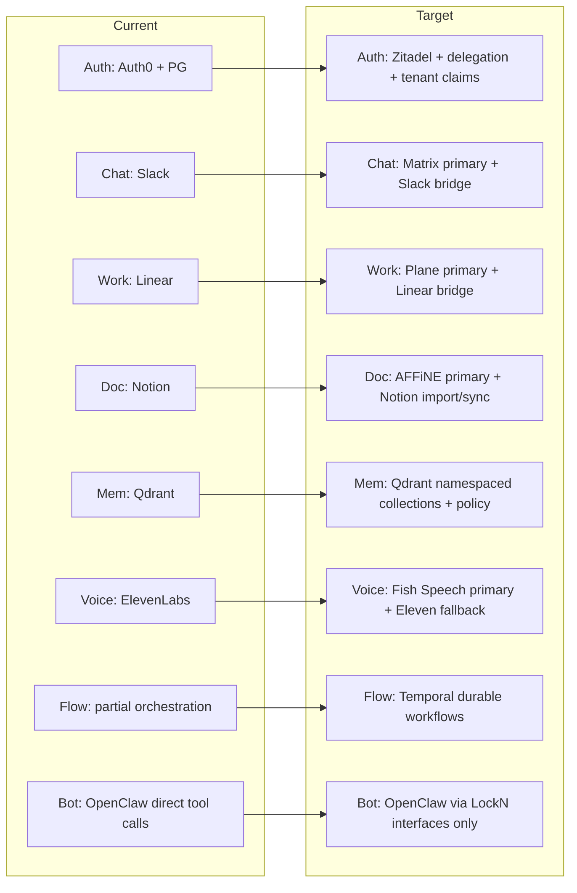
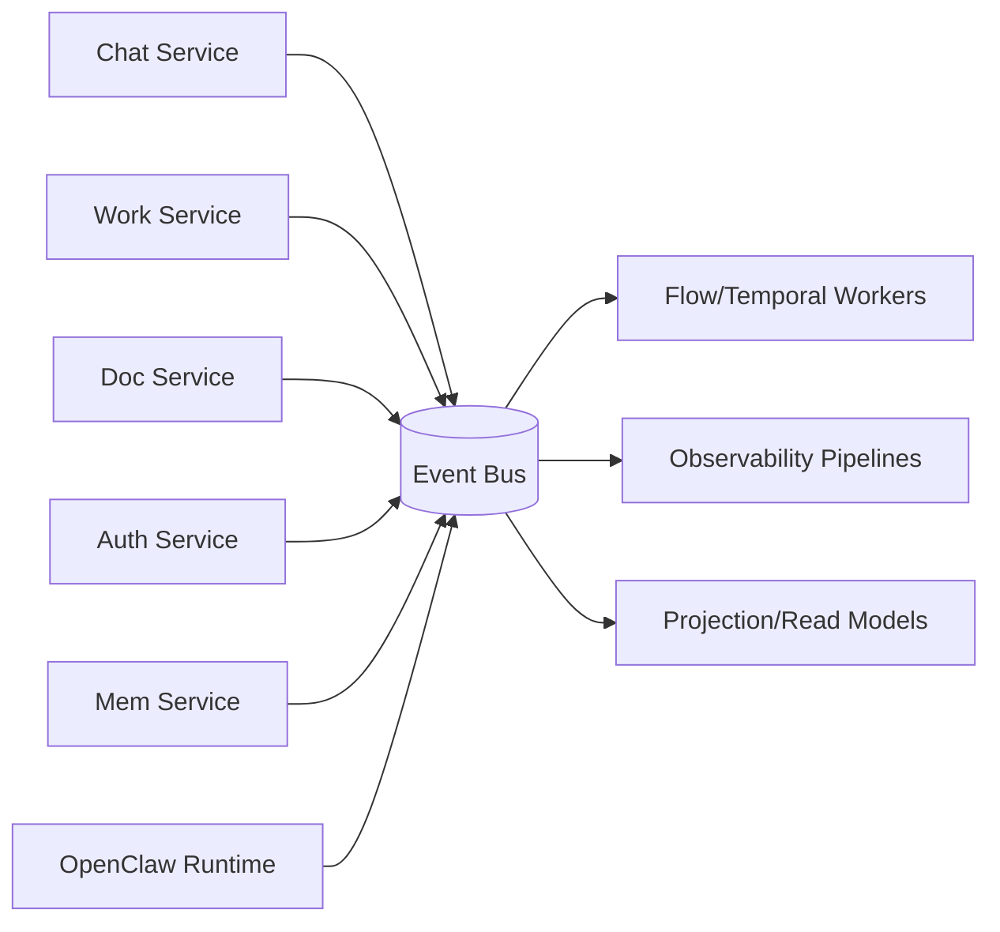
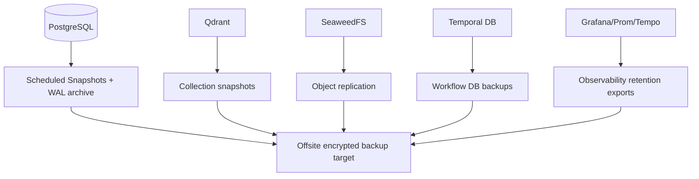
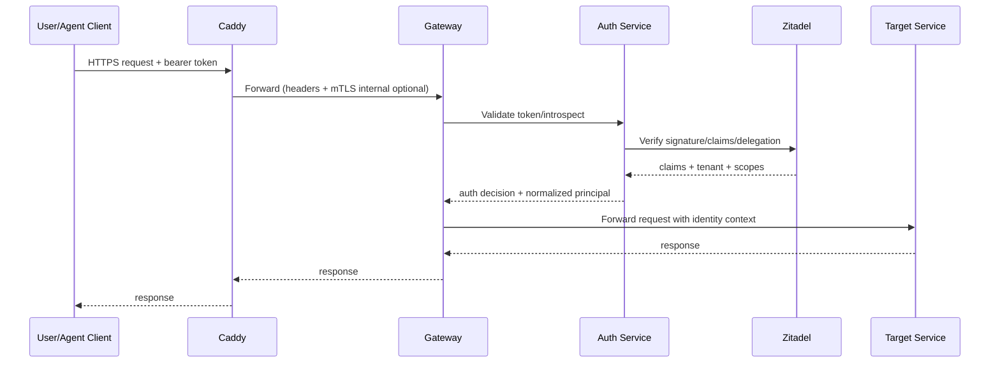

# PASS 2 — Technical Architecture Synthesis: Unified Blueprint

**Date:** 2026-02-11  
**Scope:** LockN AI unified technical architecture across current reality and target productized architecture  
**Runtime baseline:** WSL2 + Threadripper + RTX Pro 6000 Ada (48GB), 30+ Docker containers, mixed .NET/Python/Node stack

---

## 1) Unified System Architecture Diagram

### 1.1 Current → Target Unified Topology (Control Plane + Capability Plane)

```mermaid
flowchart TB
  %% Edge
  User[Users / Admins / Agents] --> CF[Cloudflare Tunnel/WAF]
  CF --> Caddy[Caddy Reverse Proxy]

  %% Gateway
  Caddy --> GW[LockN Gateway\n(.NET 9 API/BFF)]

  %% Auth
  GW --> AuthSvc[LockN.Auth.Service]
  AuthSvc --> Zitadel[Zitadel (target)]
  AuthSvc -. current .-> Auth0[Auth0 (current)]

  %% Bot runtime
  GW --> OpenClaw[OpenClaw Runtime\n(Node.js)]

  %% Module services
  OpenClaw --> ChatSvc[LockN.Chat.Service]
  OpenClaw --> WorkSvc[LockN.Work.Service]
  OpenClaw --> DocSvc[LockN.Doc.Service]
  OpenClaw --> MemSvc[LockN.Mem.Service]
  OpenClaw --> FlowSvc[LockN.Flow.Service]
  OpenClaw --> VoiceSvc[LockN.Voice.Service]
  OpenClaw --> ArchSvc[LockN.Arch.Service]

  %% Provider adapters current->target
  ChatSvc -. current .-> Slack[Slack API]
  ChatSvc --> Matrix[Matrix/Dendrite (target)]

  WorkSvc -. current .-> Linear[Linear API]
  WorkSvc --> Plane[Plane (target)]

  DocSvc -. current .-> Notion[Notion API]
  DocSvc --> AFFiNE[AFFiNE (target)]

  VoiceSvc -. current .-> Eleven[ElevenLabs]
  VoiceSvc --> Fish[Fish Speech (target)]

  %% Memory + data
  MemSvc --> Qdrant[Qdrant Vector DB]
  DocSvc --> Seaweed[SeaweedFS Blobs]
  WorkSvc --> PgOps[(PostgreSQL Ops)]
  AuthSvc --> PgAuth[(PostgreSQL Auth)]
  OpenClaw --> Garnet[Garnet/Redis Cache]
  FlowSvc --> Temporal[Temporal]

  %% AI routing
  OpenClaw --> Router[Model Routing Layer]
  Router --> Llama[llama.cpp pool\n:11436-11440]
  Router --> Ollama[Ollama :11434]
  Router --> Anthropic[Anthropic API]
  Router --> OpenAI[OpenAI API]

  %% Integrations
  OpenClaw --> GitHub[GitHub]
  OpenClaw --> Notion
  OpenClaw --> Linear
  OpenClaw --> Slack

  %% Observability
  subgraph Observability
    OTel[OTel Collector]
    Prom[Prometheus]
    Graf[Grafana]
    Tempo[Tempo]
  end

  GW --> OTel
  OpenClaw --> OTel
  ChatSvc --> OTel
  WorkSvc --> OTel
  DocSvc --> OTel
  MemSvc --> OTel
  FlowSvc --> OTel
  VoiceSvc --> OTel
  AuthSvc --> OTel
  OTel --> Prom
  OTel --> Tempo
  Prom --> Graf
  Tempo --> Graf
```

### 1.2 Module view: current implementation vs target implementation



---

## 2) .NET Aspire Integration Plan

### 2.1 Container migration strategy into Aspire AppHost

**Rule:** keep stateful infra as container resources first; convert business logic into .NET service projects where LockN owns domain behavior.

#### A) Become .NET service projects
- LockN.Gateway
- LockN.Auth.Service
- LockN.Chat.Service
- LockN.Work.Service
- LockN.Doc.Service
- LockN.Mem.Service
- LockN.Flow.Service
- LockN.Voice.Service
- LockN.Arch.Service
- Legacy .NET services already in stack (`lockn-swap`, `lockn-apikeys`, `lockn-logger`, etc.)

#### B) Stay as container resources (managed by AppHost)
- Temporal
- Dendrite/Matrix
- Qdrant
- PostgreSQL instances
- Garnet/Redis
- SeaweedFS
- OTel Collector / Prometheus / Grafana / Tempo
- Caddy (or edge shim if externalized)
- Optional Ollama (if not host-managed)

#### C) Integrate non-.NET services as Aspire containers
- **Python Score API**: container resource, internal HTTP/gRPC endpoint, discovered via Aspire service discovery name (`score-api`)
- **Python Speak/TTS**: container resource, consumed by LockN.Voice.Service as provider
- **Node OpenClaw**: Dockerfile resource in AppHost; receives injected service endpoints via env vars/references

### 2.2 Service discovery + communication pattern

- Aspire service discovery names become canonical internal DNS names.
- Inter-service auth: JWT bearer with service audience + mTLS optional in managed cloud/K8s.
- Default pattern:
  - sync low-latency calls: REST/gRPC (service-to-service)
  - async/cross-domain actions: event bus + Temporal workflow signals

### 2.3 Configuration management

- `LockN:Module:*` strongly typed options per service.
- AppHost injects:
  - endpoints via references
  - secrets via environment/secret store binding
  - feature flags (`Provider=slack|matrix`, `Provider=linear|plane`)
- Environment hierarchy:
  1. appsettings.json defaults
  2. environment-specific overlays
  3. secret store/runtime env overrides

---

## 3) API Surface Design

### 3.1 External API (customer/integrator facing)

**Entry:** `LockN.Gateway`

- `/api/v1/agents/*` — task execution, runs, status
- `/api/v1/work/*` — issue/project operations (provider-agnostic)
- `/api/v1/docs/*` — document CRUD/search
- `/api/v1/chat/*` — channel/message operations
- `/api/v1/memory/*` — semantic recall endpoints
- `/api/v1/admin/*` — tenant/provider configuration
- `/oauth/*` and `/auth/*` proxied/validated by Auth service

### 3.2 Internal API (module-to-module)

- AuthN/AuthZ decision checks via `Auth.Service` (token validation + policy)
- `Flow.Service` starts orchestrations for multi-step operations
- `Mem.Service` provides retrieval and embedding orchestration
- `Watch` is cross-cutting (OTel traces, logs, metrics)

### 3.3 Event bus topology



**Core events:**
- `auth.user.authenticated`, `auth.delegation.granted`
- `chat.message.received`, `chat.reaction.added`
- `work.issue.created/updated/state_changed`
- `doc.document.created/updated`
- `mem.points.upserted`
- `agent.run.started/completed/failed`

### 3.4 gRPC vs REST decision matrix

| Service pair | Protocol | Reason |
|---|---|---|
| Gateway → Services | REST | public-friendly, easy SDKs |
| Service ↔ Service (hot path) | gRPC | lower latency, typed contracts |
| OpenClaw ↔ Gateway | REST + SSE/WebSocket | Node-native and stream-friendly |
| Temporal workers ↔ services | gRPC/SDK native + async signals | durable workflow semantics |
| Provider adapters → third-party SaaS | REST/Webhook | dictated by vendor APIs |

### 3.5 OpenClaw ↔ .NET bridge pattern

- Keep OpenClaw as orchestration runtime.
- Move provider-specific business logic behind .NET module services.
- Bridge contract:
  - OpenClaw calls Gateway with run context (tenant, actor, trace)
  - Gateway routes to module APIs
  - Async progress via event stream/webhooks back to OpenClaw
- Result: OpenClaw remains model/tool brain; .NET remains policy/data/control plane.

---

## 4) Data Architecture

### 4.1 Data ownership by module

- **Auth**: identities, roles, grants, delegation claims (Zitadel + Auth DB)
- **Work**: issue/project mirror + sync metadata + idempotency keys
- **Doc**: canonical docs metadata + content refs + blob pointers
- **Mem**: vectorized memories, embeddings metadata, retention policies
- **Flow**: workflow histories/state in Temporal persistence
- **Watch**: metrics/traces/log indexes in Prometheus/Tempo/Loki-equivalent
- **Gateway/OpenClaw**: ephemeral run state + cache (Garnet)

### 4.2 Cross-module access pattern

**No direct DB coupling.** Access via API/events only.
- Chat needing identity: call Auth service or use claims in token.
- Work needing doc context: consume `doc.*` events + query Doc API.
- Bot needing historical context: query Mem service (not raw Qdrant).

### 4.3 Vector memory strategy (Qdrant)

Use **shared cluster, segmented collections/namespaces**:
- `tenant/{tenantId}/chat`
- `tenant/{tenantId}/work`
- `tenant/{tenantId}/doc`
- `tenant/{tenantId}/agent-runs`

Benefits: centralized operations with strict logical isolation + easier backup policy.

### 4.4 Event sourcing pattern

- Keep event sourcing native for Auth (Zitadel already event-sourced).
- Add event-carried state transfer for Work/Doc/Chat as integration events.
- Full event sourcing for all modules is optional; recommended only where replay/audit value exceeds complexity (Flow + Auth yes; others use transactional stores + outbox).

### 4.5 Backup + DR topology



RPO/RTO targets by tier:
- Control plane/auth/work/doc: low RPO (minutes)
- Memory/observability: moderate RPO (15–60 min)

---

## 5) Security Architecture

### 5.1 Request auth flow (detailed)



### 5.2 Agent identity + delegation

- Each agent has service identity (`IdentityKind=Agent`).
- User-delegated actions mint short-lived delegation grants with scoped permissions.
- Audit always stores both:
  - `actor_agent_id`
  - `on_behalf_of_user_id` (if delegated)

### 5.3 Multi-tenant isolation

- Tenant boundary enforced in:
  - JWT claims (`tenant_id`)
  - row-level data filters
  - collection namespace partitioning (Qdrant)
  - per-tenant config scopes
- Optional dedicated tenant deployments for enterprise strict isolation.

### 5.4 Secrets management

- Development: `.env` + Aspire secrets (non-prod)
- Production: external secret manager (Vault/Cloud secret store) injected at runtime
- Rotate provider/API keys with zero-downtime dual-key window.

### 5.5 Network segmentation

- Public ingress: Cloudflare + Caddy only
- Private app mesh: Gateway + services on internal network
- Data plane subnet restricted to service identities
- Admin/ops endpoints on separate management network

---

## 6) Deployment Architecture

### 6.1 Local development (`dotnet run`)

- AppHost boots full local topology (services + required containers).
- OpenClaw/Node and Python services run as referenced resources.
- Single command baseline for developer onboarding.

### 6.2 Self-hosted customer deployment

- **Mode A: Docker Compose** (SMB/mid-market)
- **Mode B: Kubernetes** (enterprise/HA)
- Same module boundaries and images; different orchestrator profile.

### 6.3 Cloud-hosted managed offering

- Multi-tenant control plane + optional dedicated tenant planes.
- Managed Zitadel, Temporal, Qdrant, observability stack with tenant quotas.

### 6.4 CI/CD pipeline

1. Contract tests (abstractions + adapter conformance)
2. Unit/integration tests
3. Build signed images
4. Security scan (SAST/DAST/container)
5. Progressive deploy (dev → staging → prod)
6. Synthetic checks + rollback gates

### 6.5 Rolling updates / zero downtime

- Blue/green or canary at Gateway and module services.
- Backward-compatible API contracts during rollout windows.
- Outbox/idempotency for async operations to tolerate retries.

---

## 7) Performance & Scalability

### 7.1 Bottleneck analysis

Primary likely bottlenecks:
1. Model inference throughput (local GPU + cloud latency)
2. OpenClaw orchestration concurrency
3. Qdrant query latency under mixed tenant load
4. Third-party SaaS API rate limits (Slack/Linear/Notion)
5. Temporal worker saturation for long-running workflows

### 7.2 Horizontal scaling strategy per module

- Gateway/Auth/Chat/Work/Doc/Mem/Flow/Voice: stateless replicas behind load balancing
- OpenClaw: scale worker replicas with queue partitioning and sticky run IDs
- Temporal workers: separate task queues by domain
- Qdrant/Postgres: scale vertically first, then cluster/replica strategy by SLA tier

### 7.3 Caching layers

- L1: in-process short TTL caches (policy, metadata)
- L2: Garnet distributed cache (token introspection, provider metadata, prompt templates)
- L3: precomputed embeddings and retrieval cache for repeated queries

### 7.4 Rate limiting + backpressure

- Edge rate limiting in Caddy/Cloudflare per tenant/API key
- Internal token bucket on high-cost operations (model calls, vector search)
- Circuit breakers for degraded providers (fallback to alternate provider/model)
- Queue-based smoothing for webhook bursts and workflow fan-out

---

## Recommended Execution Order (Technical)

1. Finalize Aspire AppHost as canonical runtime map (including Node/Python resources)
2. Enforce interface-only module access from OpenClaw (no direct provider SDK calls in core logic)
3. Introduce event bus + outbox pattern for all state-changing module events
4. Standardize tenant/actor claims and delegation tokens in Auth service
5. Complete observability baseline before major provider migrations
6. Migrate Work (Linear→Plane) first, then Doc, then Chat, then Auth default switch

---

## Appendix — Service/Protocol Summary

| Component | Runtime | Role | Primary protocol |
|---|---|---|---|
| LockN Gateway | .NET 9 | External API/BFF | REST/SSE |
| OpenClaw Runtime | Node.js | Agent orchestration | REST/WebSocket |
| Auth Service | .NET 9 | Identity/delegation/policy | gRPC + REST |
| Chat/Work/Doc Services | .NET 9 | Capability APIs + provider adapters | gRPC + REST/Webhook |
| Mem Service | .NET 9 + Qdrant | Embeddings + semantic recall | gRPC/REST |
| Flow Service | .NET 9 + Temporal | Durable orchestration | Temporal gRPC |
| Voice Service | .NET + Python backend(s) | TTS routing | REST/gRPC |
| OTel stack | Mixed containers | Observability | OTLP/PromQL/Tempo |
